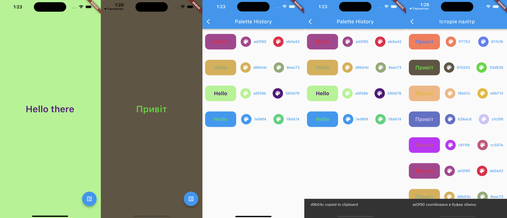

# hello_there

Hello-There project

 

App generates random combinations of colors for background and text.
Every combination stores locally on device using Hive package.
DI using GetIt package.
Alert History shows every color combination and UI example.
Color hexcode can be copy to clipboard and snackbar shows.
App supports english and ukrainian languages.
